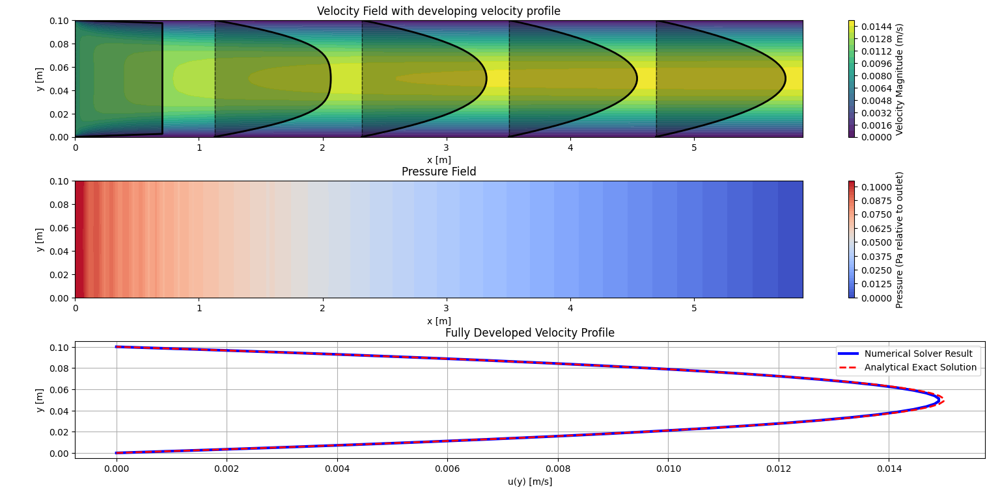

# Python 2D Laminar Pipe Flow CFD Solver

This repository contains a python 2D Computational Fluid Dynamics solver. It simulates the development of a laminar flow velocity profile inside a pipe using the **SIMPLE** (Semi-Implicit Method for Pressure Linked Equations) algorithm. 

## Functions

* **Customisable geometry, fluid medium and simulation precision:** In the first section of the code you can alter flow domain properties to your liking.
* **Laminar flow check:** Code checks to ensure the flow remains laminar (Reynolds number must be $< 2300$).
* **Automatic Length Setup:** Calculates the hydrodynamic entrance length needed for the velocity profile to fully develop based on the Reynolds number.
* **Residual Monitor:** A real-time plot tracks velocity and pressure errors to visually display the convergence of solution.
* **Visualization:** After convergence, the code generates three subplots showing the velocity field with developing profiles, the pressure field, and a comparison of code numerical solution against the exact analytical solution.

## How to Use
Firstly, check **requirements.txt** to see needed used libraries for the script.
The physics setup is located at the very top of the script in the **INPUTS** section. You can edit these to your liking or needs:

* **Geometry:** Set the height of the pipe (`H`). The length is calculated automatically.
* **Inlet velocity:** Set the initial `inlet_velocity`. 
* **Fluid Properties:** Define the density (`rho`) and dynamic viscosity (`mu_dynamic`). Right now, the material is set to water.
* **Iteration Parameters:** You can increase `max_iter` to ensure there is enough iterations for the solution to converge and adjust the `tolerance` for a precision of convergence.
* **Grid (no need to change):** If you want your solution to be even more precise, you can change number of cells in the grid by increasing nx and ny at line 55 and 56. The grid is set to $100 \times 40$ cells by default.

* **Run the script**

## How It Works 

This script solves the 2D Navier-Stokes equations by discretizing the pipe into a grid and iteratively solving the equations using **SIMPLE** algorithm.

### 1. Geometry Calculation and Discretization
Before the main loop starts, the script calculates the Reynolds number.

$$Re = \frac{\rho \cdot U_{inlet} \cdot H}{\mu}$$

If the flow is safely laminar, it calculates the Hydrodynamic Entrance Length ($L_e$). This is the exact length needed for the velocity profile to fully develop. To be safe, the total pipe length is set to $L_e$ plus a 20% margin. The domain is then split into a grid of cells. 

### 2. The SIMPLE Solver Loop
The algorithm has three main solver functions that repeat until the residual error hits the needed tolerance:

* **Solving Momentum (for direction $x$ and $y$):** For each cell, we set up $Ax = b$ matrices based on the convective and diffusive fluxes from surrounding cells. This gives us a guess for our velocity field based on old pressure field ($0 Pa$ at the beginning). 
* **Pressure Correction:** The function balances the forces acting on the fluid with the mass flux across boundaries, with the new velocity field, to get a more accurate pressure field, fulfilling the continuity equation (mass conservation).
* **Velocity Correction:** Finally, the script corrects the initially guessed velocity field based on the newly calculated pressure gradients. 

### 3. Relaxation
To prevent the simulation from agressivly diverging, the code uses **relaxation coefficients** (`alpha_u`, `alpha_v`, `alpha_p`). These act as brakes on sharp gradients, slowing down the changes between iterations.

## Visualizations

Once the solution converges, the code generates a figure with 3 subplots:
* **Velocity Field:** A contour plot of the velocity magnitude, overlaid with solid velocity profile curves at 5 different stations to show the flow developing from a flat inlet profile to a parabola.
* **Pressure Field:** A contour map showing the pressure drop along the length of the pipe (relative to the outlet).
* **Fully Developed Comparison:** A direct comparison plot at the outlet, checking the Numerical Solver Result against the Analytical Exact Solution for fully developed laminar pipe flow.

**Example of simulation result:**

